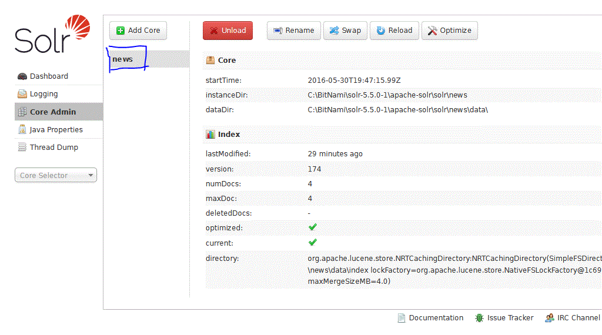

#Robson Martins
| [Linkedin: https://br.linkedin.com/in/robson-martins-6231a152/en] |
| ----------------------------------------------------------------- |

Technologies
------------

* [Solr](http://lucene.apache.org/solr/)
* [Cassandra](http://cassandra.apache.org/)
* [AngularJS](http://angularjs.org/)
* [Bootstrap](http://getbootstrap.com/)
* [Spring Security](http://projects.spring.io/spring-security/)
* [Hibernate](http://hibernate.org/)

Running
-------

Make sure is installed on your system and all of them are running:

* JDK 1.7 or above (tested with 1.7)
* Cassandra 2 or above (tested with 2.2)
* Solr 4.1 or above (tested with 5.5)
* [Maven](http://maven.apache.org/) >= 2.2.1 

1º copy RobsonMartins_SA_Solr_News/Scripts/solr-config/news TO $SOLR_HOME/apache-solr/solr

2º import by Solr's dashboard, put 'news' as follow
 

3º Go into the project dir and type mvn clean install

4º deploy in a web container or application server that you prefer (tested with Tomcat 7.0)

